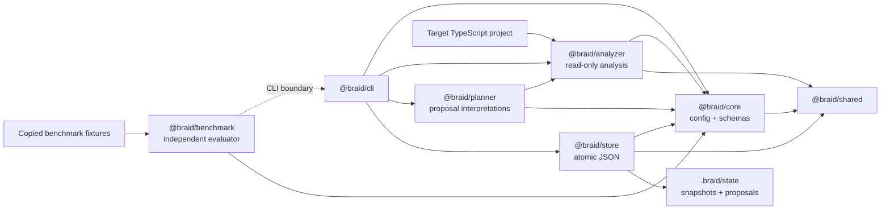

# Architecture

## Package boundaries

`@braid/core` owns validated domain data and configuration. `@braid/analyzer` is a read-only,
deterministic transformation from project files to a repository model and metrics. `@braid/store`
persists validated snapshots and proposals without knowing how they were calculated. `@braid/planner`
interprets snapshot facts as bounded migration proposals without filesystem access or console output.
`@braid/cli` coordinates the workflow and owns all human or machine output. `@braid/shared` contains
only the error hierarchy and stable project-local paths used across those boundaries. `@braid/benchmark`
is outside the product planning path: it invokes the CLI as a subprocess, validates public schemas, and
owns independent fixture analysis, expectation matching, command measurement, and reports.

The benchmark package has no dependency on `@braid/planner` or `@braid/analyzer`. This prevents Braid's
candidate selection, ranking, or metric implementation from grading itself. Fixture templates remain
tracked inputs; every benchmark run operates on disposable local Git copies.

## Analysis data flow

1. The CLI resolves the target root and loads `.braid/architecture.yaml`.
2. Zod validates the parsed YAML and reports exact invalid field paths.
3. The scanner uses configured globs and ts-morph without executing target code.
4. Static imports and re-exports become stable-sorted internal or external edges.
5. Package fields, public-entrypoint facts, normalized paths, and top-level statement shape classify
   modules; adjacency lists feed canonical file/module cycle detection.
6. Pure metric calculations apply the configured thresholds.
7. The CLI reads Git's current commit when available and creates a schema-versioned snapshot.
8. The JSON store validates, normalizes, pretty-prints, and atomically links a new snapshot file.

Analysis is deterministic because project-relative paths use POSIX separators, unordered collections
are sorted, duplicate graph traversals are canonicalized, configuration hashing uses normalized key
order, and metrics are raw calculations over the normalized model. Snapshot content remains equivalent
between unchanged analyses; only the ID and creation time identify an individual observation.

Module records carry one of five explicit kinds. Meaningful first-level directories are `feature`
modules; only deterministic directory names such as `platform`, `runtime`, `adapters`, and `internal`
become `infrastructure`. Package surfaces and top-level public indexes use
`entrypoint:<relative-stem>`, implementation-free multi-re-export files use `barrel:<relative-stem>`,
and other top-level implementation files use `root:<relative-stem>`. Consequently unrelated root files
never form one artificial `root` bucket. Entrypoints and barrels remain graph facts, but are excluded
from ordinary extraction and oversized-module interpretation.

## Proposal data flow

The analyzer owns facts: files, declarations, references, import edges, modules, cycles, and metrics.
The planner owns interpretations: candidates, evidence, expected impact, risk, reversibility, ranking,
and rollback plans. Planner conclusions are never written into snapshots.

```mermaid
flowchart LR
    Repository --> Analysis["Deterministic analysis"]
    Analysis --> Snapshot["ArchitectureSnapshot facts"]
    Snapshot --> Candidates["Cycle + symbol candidates"]
    Candidates --> Roots["Canonical SCC root causes"]
    Roots --> Evidence["Typed evidence + impact certainty"]
    Evidence --> Classification["Risk + reversibility"]
    Classification --> Ranking["Transparent tuple ranking"]
    Ranking --> Proposals["MigrationProposal JSON"]
```

Cycle root signatures hash the planner version, snapshot configuration/commit identity, canonical SCC
module set, relevant internal module edges, and normalized participating files. Proposal IDs hash schema
version, planner version, normalized snapshot content, type, target, affected
files, and modules. Absolute paths, timestamps, filesystem order, and randomness are excluded. Ranking
compares severity, confidence, expected benefit, risk penalty, affected-file count, type, and ID in that
order. It is a recommendation ordering, not an opaque architecture score.

Snapshot schema version 1 remains readable. Phase 2 adds optional declaration and top-level statement
facts; Phase 2.1 adds module kinds with a `feature` default and import type-only facts with a `false`
default. These are backward-compatible refinements rather than planner conclusions. Old snapshots can
still produce cycle proposals. Extraction is skipped, or an explicit `--type extract-module` request
reports that a fresh analysis is required. Adding normalized planner defaults changes the configuration
hash compared with the same Phase 1 YAML parsed by the old version.

No runtime model is used. The bounded heuristics are intentionally reproducible, inspectable, and able
to run offline.

## Future Codex execution boundary

Codex execution will live in a separate package and process: it will receive an approved proposal,
operate in an isolated Git worktree, and return validation evidence. It will not be imported into the
analyzer or planner. This preserves a read-only, reproducible proposal path even when execution capabilities are
added.

Feature changes and architecture migrations will be separate transactions. A prerequisite migration can
therefore be reviewed, validated, reverted, or reused independently of the feature that motivated it.
That separation also keeps rollback scope explicit and prevents a failed feature from obscuring whether
an architecture change was sound.
