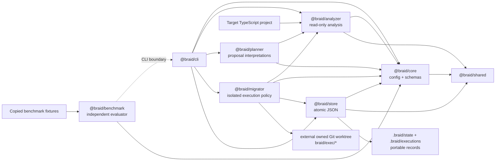

# Architecture

## Package boundaries

`@braid/core` owns validated domain data and configuration. `@braid/analyzer` is a read-only,
deterministic transformation from project files to a repository model and metrics. `@braid/store`
persists validated snapshots and proposals without knowing how they were calculated. `@braid/planner`
interprets snapshot facts as bounded migration proposals without filesystem access or console output.
`@braid/migrator` consumes one approved proposal, owns execution safety policy, and coordinates only
execution-owned external Git worktrees. It does not change analyzer or planner facts.
`@braid/cli` coordinates the workflow and owns all human or machine output. `@braid/shared` contains
only the error hierarchy and stable project-local paths used across those boundaries. `@braid/benchmark`
is outside the product planning path: proposal suites invoke the CLI as a subprocess, while the Phase 3
suite drives the public migrator interface with its deterministic scripted executor.

The proposal-quality evaluator still has no dependency on `@braid/planner` or `@braid/analyzer`, so
candidate selection and ranking do not grade themselves. The migration suite intentionally exercises
the product orchestrator and independently asserts status, Git isolation, records, and safety outcomes.
Fixture templates remain tracked inputs; every benchmark run operates on disposable local Git copies.

## Analysis data flow

1. The CLI resolves the target root and loads `.braid/architecture.yaml`.
2. Zod validates the parsed YAML and reports exact invalid field paths.
3. The scanner uses configured globs and ts-morph without executing target code.
4. Static imports and re-exports become stable-sorted internal or external edges.
5. Package fields, public-entrypoint facts, normalized paths, and top-level statement shape classify
   modules; adjacency lists feed canonical file/module cycle detection.
6. Pure metric calculations apply the configured thresholds.
7. The CLI reads Git's current commit and, for Git repositories, a deterministic tracked-source
   fingerprint before creating a schema-versioned snapshot.
8. The JSON store validates, normalizes, pretty-prints, and atomically links a new snapshot file.

Analysis is deterministic because project-relative paths use POSIX separators, unordered collections
are sorted, duplicate graph traversals are canonicalized, configuration hashing uses normalized key
order, and metrics are raw calculations over the normalized model. Snapshot content remains equivalent
between unchanged analyses; only the ID and creation time identify an individual observation.
Execution-only migration settings have a separate fingerprint, so adding disabled Phase 3 defaults
does not change Phase 2 analysis/planning configuration identity.

Module records carry one of five explicit kinds. Meaningful first-level directories are `feature`
modules; only deterministic directory names such as `platform`, `runtime`, `adapters`, and `internal`
become `infrastructure`. Package surfaces and top-level public indexes use
`entrypoint:<relative-stem>`, implementation-free multi-re-export files use `barrel:<relative-stem>`,
and other top-level implementation files use `root:<relative-stem>`. Consequently unrelated root files
never form one artificial `root` bucket. Entrypoints and barrels remain graph facts, but are excluded
from ordinary extraction and oversized-module interpretation.

## Proposal data flow

The analyzer owns facts: files, declarations, references, import edges, modules, cycles, and metrics.
The planner owns interpretations: candidates, evidence, expected impact, risk, reversibility, ranking,
and rollback plans. Planner conclusions are never written into snapshots.

```mermaid
flowchart LR
    Repository --> Analysis["Deterministic analysis"]
    Analysis --> Snapshot["ArchitectureSnapshot facts"]
    Snapshot --> Candidates["Cycle + symbol candidates"]
    Candidates --> Roots["Canonical SCC root causes"]
    Roots --> Evidence["Typed evidence + impact certainty"]
    Evidence --> Classification["Risk + reversibility"]
    Classification --> Ranking["Transparent tuple ranking"]
    Ranking --> Proposals["MigrationProposal JSON"]
```

Cycle root signatures hash the planner version, snapshot configuration/commit identity, canonical SCC
module set, relevant internal module edges, and normalized participating files. Proposal IDs hash schema
version, planner version, normalized snapshot content, type, target, affected
files, and modules. Absolute paths, timestamps, filesystem order, and randomness are excluded. Ranking
compares severity, confidence, expected benefit, risk penalty, affected-file count, type, and ID in that
order. It is a recommendation ordering, not an opaque architecture score.

Snapshot schema version 1 remains readable. Phase 2 adds optional declaration and top-level statement
facts; Phase 2.1 adds module kinds with a `feature` default and import type-only facts with a `false`
default. These are backward-compatible refinements rather than planner conclusions. Old snapshots can
still produce cycle proposals. Extraction is skipped, or an explicit `--type extract-module` request
reports that a fresh analysis is required. Adding normalized planner defaults changes the configuration
hash compared with the same Phase 1 YAML parsed by the old version.

No runtime model is used. The bounded heuristics are intentionally reproducible, inspectable, and able
to run offline.

## Migration execution boundary

Codex execution lives in `@braid/migrator` behind a `MigrationExecutor` interface. The planner never
creates a branch, worktree, process, or commit. The production adapter invokes `codex exec` with an
argument array, ephemeral JSONL output, `workspace-write`, approval disabled inside the bounded run,
and an explicit disposable staging repository, with workspace network access disabled. The standalone
stage has no remote and shares no object database with the source repository. A capability check chooses
the installed CLI's supported `--cd` or `-C` form and either the approval flag or its safe config
equivalent. The CI-only scripted executor goes through the same orchestration path.

The source checkout is fingerprinted immediately before worktree execution and checked again before and
after candidate commit creation. HEAD, symbolic branch, index tree, tracked-source manifest,
non-runtime status, local Git configuration, protected shared refs, repository metadata, and lock files
must remain identical. Only the exact execution-owned candidate ref and worktree administration are
excluded; sibling `braid/exec/*` refs remain protected. Package
manifests, lockfiles, TypeScript configuration, public entrypoint contents, and public export facts
receive a second independent before/after check. Machine-local worktree paths exist only in an ignored
locator; portable reports contain project-relative paths and hashes.

Feature changes and architecture migrations will be separate transactions. A prerequisite migration can
therefore be reviewed, validated, reverted, or reused independently of the feature that motivated it.
Phase 3 creates reviewable local candidates but does not execute rollback, merge, or push operations.
