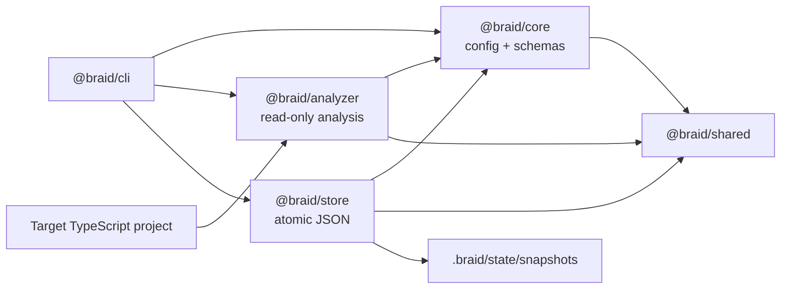

# Architecture

## Package boundaries

`@braid/core` owns validated domain data and configuration. `@braid/analyzer` is a read-only,
deterministic transformation from project files to a repository model and metrics. `@braid/store`
persists validated snapshots without knowing how they were calculated. `@braid/cli` coordinates the
workflow and owns all human or machine output. `@braid/shared` contains only the error hierarchy and
stable project-local paths used across those boundaries.

## Analysis data flow

1. The CLI resolves the target root and loads `.braid/architecture.yaml`.
2. Zod validates the parsed YAML and reports exact invalid field paths.
3. The scanner uses configured globs and ts-morph without executing target code.
4. Static imports and re-exports become stable-sorted internal or external edges.
5. Directory rules classify modules; adjacency lists feed canonical file/module cycle detection.
6. Pure metric calculations apply the configured thresholds.
7. The CLI reads Git's current commit when available and creates a schema-versioned snapshot.
8. The JSON store validates, normalizes, pretty-prints, and atomically links a new snapshot file.

Analysis is deterministic because project-relative paths use POSIX separators, unordered collections
are sorted, duplicate graph traversals are canonicalized, configuration hashing uses normalized key
order, and metrics are raw calculations over the normalized model. Snapshot content remains equivalent
between unchanged analyses; only the ID and creation time identify an individual observation.

## Future Codex execution boundary

A future migration proposer can consume a validated snapshot and produce a validated `Migration` record.
Codex execution will live in a separate package and process: it will receive an approved migration,
operate in an isolated Git worktree, and return validation evidence. It will not be imported into the
analyzer. This preserves a read-only, reproducible analysis path even when execution capabilities are
added.

Feature changes and architecture migrations will be separate transactions. A prerequisite migration can
therefore be reviewed, validated, reverted, or reused independently of the feature that motivated it.
That separation also keeps rollback scope explicit and prevents a failed feature from obscuring whether
an architecture change was sound.
